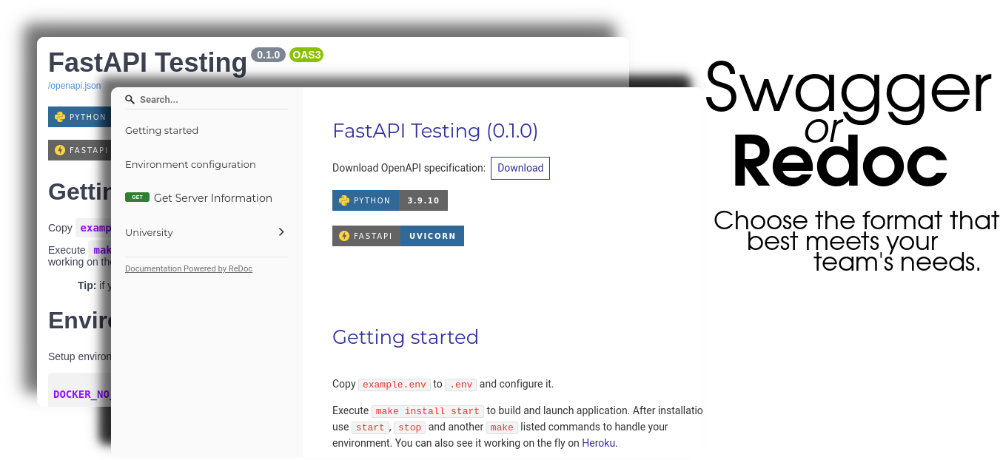

# FastAPI Testing


# Getting started

Copy `example.env` to `.env` and configure it.

Execute `make install start` to build and launch application. After installation use `start`, `stop` and another `make` listed commands to handle your environment. You can also see it working on the fly on [Heroku](https://tech2heal.herokuapp.com/).

> **Tip:** if you're using Windows, first install Makefile support running `choco install make --source=cygwin` on your favorite command interpreter.

## Installing on Linux environment

Using Makefile, the example above shows the execution of `make build start` command:

[](https://asciinema.org/a/2NnMG5CGHSCyJielWr8aT4Qgy)

# First steps

Once your system is running you can access the address set (generally `http://localhost`) and it will present you with a JSON containing the environment in which the application is running and the configured collections.

To navigate between the endpoints of your application, use Swagger, via the url `http://localhost/docs` or Redocly via `http://localhost/redoc`.



Try it online by going to [Swagger](https://tech2heal.herokuapp.com/docs) or [Redocly](https://tech2heal.herokuapp.com/redoc) via the online platform via Heroku.

# Environment configuration

Setup environment variables above in your `.env` file:

```apache
DOCKER_NO_CACHE=N
# …To provide cache for build processes.
# Set `Y` to force build processes without cache.

DOCKER_DETACHED=Y
# …To execute start/up/launch commands silently… Or not.

DOCKER_OPTIONAL=Y
# …To append database to the project infraestructure.
```

> **Tip:**  Makefile `build` and `restart` commands allows to define targeted containers according to the following to build/rebuild only application container:
> ```sh
> ONLY=application make build
> ```

---

See more on

[](https://github.com/jmurowaniecki/tech2heal)
[](https://tech2heal.herokuapp.com/)
[](https://tech2heal.Dockerapp.com/)


